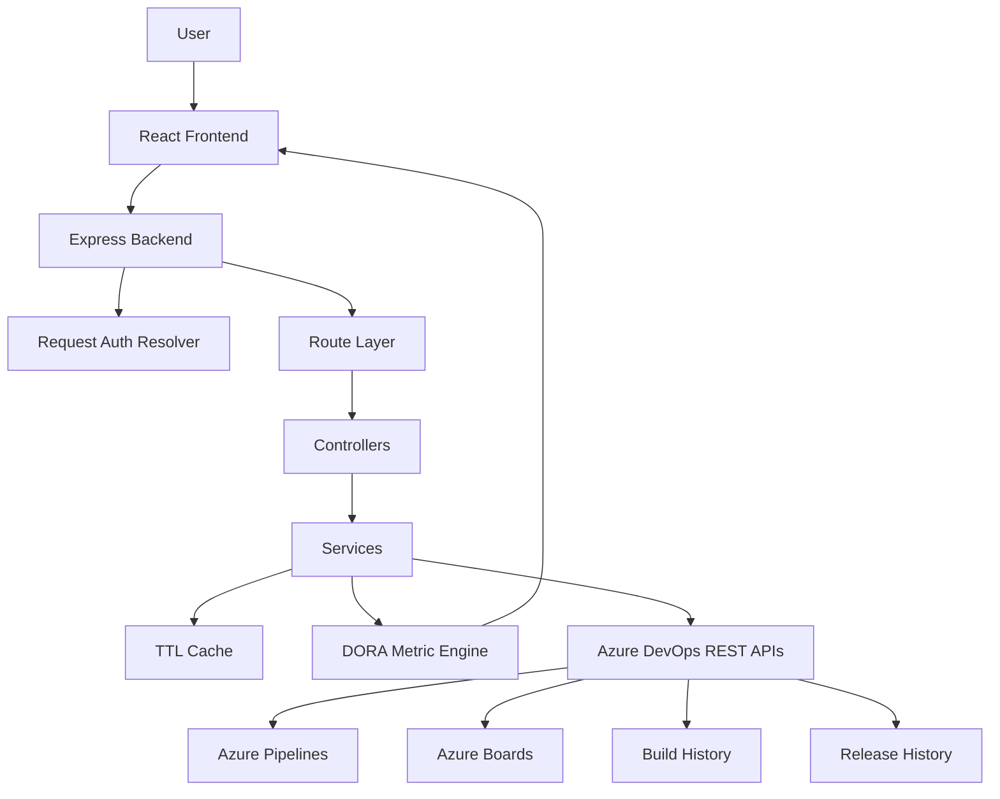
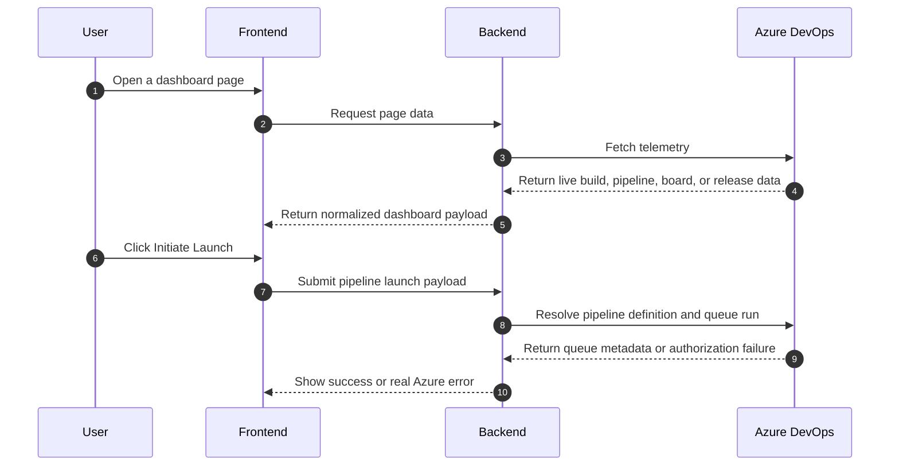

# DORA Metrics & Release Health Command Center

This repository is a full-stack Azure DevOps observability app for DORA metrics and release health. It is designed to read live telemetry from Azure DevOps, calculate delivery metrics from that telemetry, and present the result in a dashboard that leadership can actually use.

The application centers on the four DORA metrics:

1. Deployment Frequency
2. Lead Time for Changes
3. Change Failure Rate
4. Mean Time to Recovery

The UI identity is intentionally normalized to `Gargi and Rudra`.

## What the system is trying to do

This app answers the practical delivery questions that show up in release reviews:

- Are we shipping often enough?
- Are changes reaching production fast enough?
- Are changes introducing too much risk?
- Are we recovering quickly enough when something goes wrong?

It also supports a real launch flow from the dashboard. The pipeline launch modal is not decorative. It loads live pipeline definitions and submits a real Azure DevOps queue request through the backend.

## Architecture





## Layer model

The repo is intentionally split into a few layers so each concern stays in one place.

### 1. Presentation layer
Lives in `frontend/src`.

This layer owns:
- pages
- components
- charts
- tables
- filters
- layout
- animation and feedback

It renders state, but it should not know Azure DevOps API details.

### 2. Transport layer
Lives in `backend/src/controllers` and `backend/src/routes`.

This layer owns:
- endpoint mapping
- request parsing
- response formatting
- HTTP status codes

Controllers should stay thin. They move data in and out, but they should not contain the real business logic.

### 3. Business layer
Lives in `backend/src/services`.

This layer owns:
- deployment ledger creation
- incident ledger creation
- DORA calculations
- launch orchestration
- Azure response normalization
- caching behavior

### 4. Integration layer
Lives in `backend/src/config` and `backend/src/middleware/auth.js`.

This layer owns:
- PAT resolution
- Azure API client creation
- request-scoped auth behavior

### 5. Shared utility layer
Lives in `frontend/src/utils` and `backend/src/utils`.

This layer owns:
- formatting helpers
- metric helpers
- dates
- logging
- display-name normalization

## Repository layout

```text
frontend/                 React client app
backend/                  Express API server
azure-pipelines.yml       Azure DevOps pipeline definition
README.md                 Project documentation
```

## Runtime bootstrap

### Frontend boot path

1. `frontend/index.html` loads the HTML shell.
2. `frontend/src/main.jsx` mounts the React app.
3. `frontend/src/App.jsx` installs application providers and routing.
4. `frontend/src/routes/AppRoutes.jsx` maps routes to page components.
5. `frontend/src/components/layout/ProtectedLayout.jsx` wraps the app shell around all pages.
6. Page components request data through `frontend/src/services/api.js`.

### Backend boot path

1. `backend/server.js` starts the process.
2. `backend/app.js` builds the Express app.
3. `backend/src/config/env.js` loads and validates environment variables.
4. `backend/src/config/azure.js` creates Azure DevOps API clients.
5. `backend/src/middleware/auth.js` attaches the request PAT context.
6. `backend/src/routes/*` bind URLs to controllers.
7. `backend/src/controllers/*` call into services.
8. `backend/src/services/*` talk to Azure and compute outputs.

## Frontend structure

The frontend is the user-facing dashboard. It handles navigation, layout, data fetches, charts, tables, filters, launch controls, and all visible feedback.

### Frontend root files

- `frontend/index.html`: Vite entry HTML document.
- `frontend/package.json`: frontend scripts and dependencies.
- `frontend/package-lock.json`: locked dependency tree.
- `frontend/vite.config.js`: Vite build and dev configuration.
- `frontend/tailwind.config.js`: Tailwind theme config.
- `frontend/postcss.config.js`: PostCSS config.
- `frontend/jsconfig.json`: editor and import support.
- `frontend/.env`: frontend runtime environment values.
- `frontend/public/*`: static browser assets like icons, manifest, favicon, and robots rules.
- `frontend/src/main.jsx`: React boot entry point.
- `frontend/src/App.jsx`: root component and provider wrapper.
- `frontend/src/App.css`: app-specific CSS.
- `frontend/src/index.css`: global CSS bootstrap.

### Frontend folder map

- `frontend/src/assets/`: local assets used by the UI.
- `frontend/src/components/cards/`: cards for metrics, summaries, and insights.
- `frontend/src/components/charts/`: chart components for the various metric views.
- `frontend/src/components/effects/`: animated backgrounds and visual effects.
- `frontend/src/components/feedback/`: loading, error, empty, and toast states.
- `frontend/src/components/filters/`: filters used across pages.
- `frontend/src/components/layout/`: app shell, navigation, footer, page framing, and launch modal.
- `frontend/src/components/tables/`: ledgers and list renderers.
- `frontend/src/components/ui/`: buttons, selects, inputs, modals, toggles, tooltips, avatars, badges.
- `frontend/src/context/`: React contexts for shared state.
- `frontend/src/hooks/`: custom hooks for data and interaction logic.
- `frontend/src/pages/`: routed page surfaces.
- `frontend/src/routes/`: route definitions.
- `frontend/src/services/`: frontend API wrappers.
- `frontend/src/styles/`: CSS layers and tokens.
- `frontend/src/utils/`: helper functions.

### Frontend file-by-file notes

#### `frontend/src/App.jsx`
This is the root composition layer.

What it does:
- wraps the app in `BrowserRouter`
- installs `ThemeProvider`, `FilterProvider`, and `DashboardProvider`
- mounts the shared toast container
- makes global state available to every page

Why it matters:
- without these providers, the app would render without shared state, theme control, and notification support

#### `frontend/src/main.jsx`
This is the browser bootstrap file.

What it does:
- imports React
- imports the global CSS
- mounts the React tree into the root DOM node

Why it matters:
- this is the handoff from static HTML to the interactive application

#### `frontend/src/routes/AppRoutes.jsx`
This file defines which page appears for each route.

What it does:
- wires the dashboard, deployments, incidents, analytics, reports, and settings pages
- wraps them in the protected layout
- redirects unmatched routes to the not-found page

Why it matters:
- navigation and deep-linking depend on this file

#### `frontend/src/components/layout/ProtectedLayout.jsx`
This is the main app shell and launch interaction hub.

What it does:
- renders sidebar and top bar
- hosts the launch modal
- loads live pipeline definitions when the modal opens
- submits launch requests to the backend
- shows the current profile

Deeper behavior:
- the selected pipeline is stored as a live Azure pipeline ID
- the modal does not use fake pipeline options
- launch submission waits for the backend response before declaring success
- all launch feedback is routed through the toast system

#### `frontend/src/components/layout/Navbar.jsx`
The top navigation bar.

What it does:
- shows the current section title
- shows the connection badge and profile summary
- provides global search and status cues

Why it matters:
- it keeps the user oriented while moving across operational pages

#### `frontend/src/components/layout/Sidebar.jsx`
The vertical navigation rail.

What it does:
- links the main pages
- provides the pipeline launch button
- shows the user identity block

Why it matters:
- it is the fastest path to the key operational surfaces

#### `frontend/src/components/layout/Footer.jsx`
The bottom status bar.

What it does:
- shows system state
- surfaces operational health text

Why it matters:
- it gives the dashboard a persistent heartbeat

#### `frontend/src/components/layout/PageContainer.jsx`
The page wrapper.

What it does:
- keeps page spacing and overflow stable
- ensures content does not collide with the shell

#### `frontend/src/components/layout/PageHeader.jsx`
Reusable page title block.

What it does:
- standardizes page headings
- reduces repeated layout code

### Cards

#### `frontend/src/components/cards/MetricCard.jsx`
Displays one core metric with the value, label, and supporting context.

#### `frontend/src/components/cards/StatusCard.jsx`
Shows status or health information in a compact summary block.

#### `frontend/src/components/cards/ActivityCard.jsx`
Shows recent activity or recent operational updates.

#### `frontend/src/components/cards/SummaryCard.jsx`
Compact summary tile for secondary metrics or insight displays.

#### `frontend/src/components/cards/GlassCard.jsx`
Shared card wrapper for the glass-style UI treatment.

#### `frontend/src/components/cards/InsightCard.jsx`
Displays guided insight or recommendations based on the current data.

### Charts

#### `frontend/src/components/charts/DeploymentChart.jsx`
Shows deployment activity over time.

#### `frontend/src/components/charts/LeadTimeChart.jsx`
Shows lead time trend data.

#### `frontend/src/components/charts/FailureRateChart.jsx`
Shows change failure patterns.

#### `frontend/src/components/charts/MTTRChart.jsx`
Shows mean time to recovery patterns.

#### `frontend/src/components/charts/MonthlyChart.jsx`
Monthly timeline visualization.

#### `frontend/src/components/charts/WeeklyChart.jsx`
Weekly timeline visualization.

#### `frontend/src/components/charts/PieOverview.jsx`
Composition or share chart.

#### `frontend/src/components/charts/Sparkline.jsx`
Compact inline trend view.

### Feedback components

#### `frontend/src/components/feedback/Loader.jsx`
Active loading indicator.

#### `frontend/src/components/feedback/Skeleton.jsx`
Placeholder content while a request is in flight.

#### `frontend/src/components/feedback/ErrorState.jsx`
Failure surface when a request cannot succeed.

#### `frontend/src/components/feedback/EmptyState.jsx`
Empty-state surface when Azure returns no rows.

#### `frontend/src/components/feedback/NoData.jsx`
Fallback display for empty data sets.

#### `frontend/src/components/feedback/ToastMessage.jsx`
Toast helper functions for success and error notifications.

### Filters

#### `frontend/src/components/filters/DateFilter.jsx`
Controls time window selection.

#### `frontend/src/components/filters/EnvironmentFilter.jsx`
Switches between environments such as production, staging, and canary.

#### `frontend/src/components/filters/PipelineFilter.jsx`
Filters by pipeline.

#### `frontend/src/components/filters/SearchBar.jsx`
Search input used across ledgers and lists.

#### `frontend/src/components/filters/StatusFilter.jsx`
Filters by status.

### Tables

#### `frontend/src/components/tables/DeploymentTable.jsx`
Deployment ledger rows and actions.

#### `frontend/src/components/tables/IncidentTable.jsx`
Incident and outage rows.

#### `frontend/src/components/tables/WorkItemTable.jsx`
Azure Boards work-item rows.

#### `frontend/src/components/tables/TableHeader.jsx`
Header row abstraction.

#### `frontend/src/components/tables/TablePagination.jsx`
Pagination controls.

#### `frontend/src/components/tables/StatusBadge.jsx`
Status chip component.

### UI primitives

The `frontend/src/components/ui` folder contains reusable controls used by the larger interface:

- `Avatar.jsx`
- `Badge.jsx`
- `Button.jsx`
- `Divider.jsx`
- `Dropdown.jsx`
- `Input.jsx`
- `Modal.jsx`
- `Select.jsx`
- `Toggle.jsx`
- `Tooltip.jsx`

These are the control primitives used by forms, headers, tables, and dialogs.

### Context providers

#### `frontend/src/context/DashboardContext.jsx`
Shared dashboard data state.

#### `frontend/src/context/FilterContext.jsx`
Shared filter state across pages.

#### `frontend/src/context/ThemeContext.jsx`
Theme and mode state.

### Hooks

#### `frontend/src/hooks/useDeployments.js`
Fetches deployment data and exposes refresh/trigger behavior.

#### `frontend/src/hooks/useIncidents.js`
Fetches incident data and exposes refresh/create/resolve behavior.

#### `frontend/src/hooks/useMetrics.js`
Fetches DORA metrics and trend data.

#### `frontend/src/hooks/usePagination.js`
Pagination state and actions.

#### `frontend/src/hooks/useSearch.js`
Search state and actions.

#### `frontend/src/hooks/useTheme.js`
Theme access helper.

### Pages

#### `frontend/src/pages/Dashboard/Dashboard.jsx`
Primary overview page.

What it shows:
- DORA metric cards
- trend charts
- summary panels
- recent deployments

Why it matters:
- this is the executive and daily-ops landing screen

#### `frontend/src/pages/Deployments/Deployments.jsx`
Deployment ledger page.

What it shows:
- pipeline run history
- filters
- deployment rows

#### `frontend/src/pages/Incidents/Incidents.jsx`
Incident and outage page.

What it shows:
- Azure Boards incidents
- empty state when Azure returns nothing
- incident filters and history

#### `frontend/src/pages/Reports/Reports.jsx`
Report page.

What it shows:
- summary outputs
- export controls
- report-related guidance

#### `frontend/src/pages/Analytics/Analytics.jsx`
Deeper telemetry and analysis page.

#### `frontend/src/pages/Settings/Settings.jsx`
Dashboard configuration and preferences page.

#### `frontend/src/pages/NotFound/NotFound.jsx`
Fallback page for invalid routes.

### Services

#### `frontend/src/services/api.js`
Shared Axios client.

What it does:
- sets the API base URL
- attaches a stored auth token if present
- unwraps standard backend success envelopes
- normalizes backend error payloads

Why it matters:
- every frontend request goes through this client

#### `frontend/src/services/authService.js`
Fetches the current authenticated Azure-backed profile.

#### `frontend/src/services/deploymentService.js`
Calls deployment list and launch endpoints.

#### `frontend/src/services/incidentService.js`
Calls incident list/create/resolve endpoints.

#### `frontend/src/services/metricsService.js`
Calls metric and trend endpoints.

#### `frontend/src/services/pipelineService.js`
Loads live pipelines and build history.

#### `frontend/src/services/projectService.js`
Loads Azure projects.

#### `frontend/src/services/reportService.js`
Builds report payloads from real data.

#### `frontend/src/services/workItemService.js`
Loads Azure Boards work items.

### Utility files

#### `frontend/src/utils/displayNames.js`
Normalizes display names so the app shows `Gargi and Rudra`.

#### `frontend/src/utils/doraGrading.js`
Translates DORA values into grades and labels.

#### `frontend/src/utils/calculateTrend.js`
Trend helper logic.

#### `frontend/src/utils/chartConfig.js`
Shared chart configuration.

#### `frontend/src/utils/colors.js`
Theme color values.

#### `frontend/src/utils/constants.js`
Static frontend constants.

#### `frontend/src/utils/formatDate.js`
Date formatting helper.

#### `frontend/src/utils/formatNumber.js`
Number formatting helper.

#### `frontend/src/utils/helpers.js`
General helper functions.

#### `frontend/src/utils/statusColor.js`
Status-to-color mapping.

## Backend structure

The backend is the Azure DevOps integration layer. It owns authentication, API calls, request validation, caching, data normalization, DORA calculations, and launch handling.

### Backend root files

- `backend/package.json`: backend scripts and dependencies.
- `backend/package-lock.json`: locked dependency tree.
- `backend/.env`: local Azure credentials file.
- `backend/.env.example`: example env file.
- `backend/README.md`: backend-specific documentation.
- `backend/app.js`: Express application assembly.
- `backend/server.js`: runtime bootstrap and shutdown handling.
- `backend/test_integration.js`: integration test harness.
- `backend/test_stress.js`: stress test harness.

### Backend folder map

- `backend/src/config/`: environment loading and Azure client setup.
- `backend/src/controllers/`: HTTP controllers.
- `backend/src/middleware/`: auth, validation, 404 handling, and error handling.
- `backend/src/routes/`: endpoint wiring.
- `backend/src/services/`: Azure reads/writes and business logic.
- `backend/src/utils/`: logging, date, and metric helpers.

### Backend file-by-file notes

#### `backend/src/config/env.js`
Reads and validates environment variables.

What it does:
- loads dotenv values
- checks required Azure configuration keys
- exposes the normalized runtime config

Why it matters:
- the server should fail fast if Azure configuration is missing

#### `backend/src/config/azure.js`
Creates Azure DevOps Axios clients.

What it does:
- builds the core client for Azure DevOps REST calls
- builds the release client for classic release APIs
- adds PAT auth headers

Why it matters:
- every Azure call depends on these preconfigured clients

#### `backend/src/middleware/auth.js`
Resolves the effective PAT for each request.

What it does:
- uses the system PAT by default
- optionally accepts a Bearer override token
- attaches request-scoped Azure client factories

Why it matters:
- it ensures each request uses the correct Azure identity

#### `backend/src/middleware/errorHandler.js`
Turns raw errors into safe JSON responses.

What it does:
- logs the actual error internally
- returns a clean client-facing message
- maps common Azure errors to user-friendly error codes

Why it matters:
- the UI should get actionable feedback, not raw stack noise

#### `backend/src/middleware/notFound.js`
Returns a 404 for unmatched routes.

#### `backend/src/middleware/validation.js`
Validates route inputs such as pagination and launch payloads.

Why it matters:
- it protects the backend from malformed traffic and bad request shapes

### Controllers

Controllers are thin request handlers. They accept input, call services, and return JSON.

#### `backend/src/controllers/authController.js`
Returns the authenticated Azure profile data.

#### `backend/src/controllers/dashboardController.js`
Builds the combined dashboard payload.

#### `backend/src/controllers/deploymentController.js`
Returns deployment ledgers and accepts launch requests.

#### `backend/src/controllers/incidentController.js`
Returns incident ledgers, creates incidents, and resolves incidents.

#### `backend/src/controllers/metricsController.js`
Returns DORA metrics and trend data.

#### `backend/src/controllers/pipelineController.js`
Returns pipelines and build history.

#### `backend/src/controllers/projectController.js`
Returns Azure DevOps projects.

#### `backend/src/controllers/workItemController.js`
Returns Azure Boards work items.

### Routes

The route files bind endpoints to controller methods.

- `backend/src/routes/authRoutes.js`
- `backend/src/routes/dashboardRoutes.js`
- `backend/src/routes/deploymentRoutes.js`
- `backend/src/routes/incidentRoutes.js`
- `backend/src/routes/metricsRoutes.js`
- `backend/src/routes/pipelineRoutes.js`
- `backend/src/routes/projectRoutes.js`
- `backend/src/routes/workItemRoutes.js`

These keep the transport layer separate from the actual business logic.

### Services

#### `backend/src/services/cacheService.js`
In-memory TTL cache.

What it does:
- stores computed responses by user and filter key
- reduces repeated Azure requests
- expires data quickly so the app stays current

Why it matters:
- this keeps the dashboard fast without turning it into stale snapshot software

#### `backend/src/services/azureService.js`
Shared Azure helper service.

What it does:
- executes WIQL queries
- fetches work item batches
- centralizes Azure request helper logic

Why it matters:
- incident and work-item services build on top of it

#### `backend/src/services/deploymentService.js`
Deployment ledger and launch orchestration.

What it does:
- reads classic release deployments
- reads build history
- merges those sources into one deployment ledger
- filters and paginates the list
- queues a real pipeline or release on launch

Detailed launch behavior:
- resolves a pipeline by `pipelineId` or by name
- tries the Azure Build Queue API first
- falls back to the pipeline runs endpoint if needed
- if no match exists, raises a real not-found style error instead of fabricating a run
- returns live Azure queue metadata when the run succeeds

#### `backend/src/services/incidentService.js`
Incident and outage ledger logic.

What it does:
- queries Azure Boards for the configured incident work item type
- hydrates work items into full records
- derives severity, status, duration, and timeline fields
- creates and resolves incident work items

Detailed incident behavior:
- queries Azure Boards with WIQL
- pulls every matching ID back into full work items
- maps `System.Title`, `System.State`, `System.Tags`, and created/closed dates into dashboard fields
- converts priority into severity
- keeps action items empty unless Azure provides actual structured content

#### `backend/src/services/metricsService.js`
DORA metric calculation logic.

What it does:
- fetches deployment data and incident data in parallel
- isolates the selected time window
- computes deployment frequency
- computes lead time for changes
- computes change failure rate
- computes mean time to recovery
- generates sparkline arrays for each metric
- returns a normalized metrics object for the frontend

Detailed metric flow:
- first pulls a large enough history window to support aggregation
- filters deployment records into current and previous periods
- filters incident records into current and previous periods
- uses success deployments for deployment frequency and lead time
- uses all deployments for failure rate
- uses resolved incidents for MTTR
- builds the stage health block shown in the UI
- caches the finished metrics payload briefly so the dashboard stays responsive

#### `backend/src/services/pipelineService.js`
Pipeline discovery and build history.

What it does:
- lists Azure pipeline definitions
- fetches build history with filters
- returns a normalized array for the frontend

Why it matters:
- the launch modal and deployment surfaces depend on live pipeline knowledge

#### `backend/src/services/projectService.js`
Azure project discovery.

What it does:
- lists accessible Azure DevOps projects

#### `backend/src/services/workItemService.js`
Azure Boards work-item reporting.

What it does:
- lists work items for reporting and review surfaces

### Utility helpers

#### `backend/src/utils/logger.js`
Structured logger used across the backend.

#### `backend/src/utils/dateUtils.js`
Date helpers used by metrics and filtering.

#### `backend/src/utils/metricUtils.js`
Metric rating helpers and DORA scoring logic.

### Server bootstrap

#### `backend/app.js`
This file assembles the Express app.

What it does:
- adds request timing instrumentation
- enables security and compression middleware
- configures CORS rules
- applies rate limiting
- installs HTTP logging
- registers JSON body parsing
- mounts all API routes
- exposes the health endpoint
- wires the not-found and error handlers

Why it matters:
- this is the central application wiring file that defines how every request is processed

#### `backend/server.js`
This file starts the backend process.

What it does:
- listens on the configured port
- logs startup details
- handles clean shutdown signals
- reports unhandled exceptions and promise rejections

Why it matters:
- this is the operational entry point for local development and production runs

## Data flow in practice

### Dashboard read flow

1. The user opens a page.
2. The frontend calls the backend API.
3. The backend resolves the active PAT and Azure client.
4. The backend reads Azure DevOps telemetry.
5. The backend normalizes Azure objects into dashboard-friendly records.
6. The frontend renders charts, cards, tables, and status blocks.

Supporting detail:
- the frontend does not invent metric values
- the backend does not fabricate deployment or incident rows when Azure returns nothing
- empty states are real, so missing data is visible instead of hidden

### Launch flow

1. The user clicks `Initiate Launch`.
2. The launch modal opens.
3. Live pipelines are loaded from the backend.
4. The user chooses a pipeline, environment, and version.
5. The frontend posts the payload to `POST /api/deployments`.
6. The backend resolves the Azure pipeline definition.
7. The backend attempts a real queue request.
8. Azure returns either a queued run or a real authorization or access failure.
9. The frontend shows the actual result.

Supporting detail:
- the queue flow is server-side on purpose because the PAT should not live in the browser
- the backend centralizes fallback logic and error translation
- the modal is a control surface, not the system of record

## How to read the codebase in order

### Frontend reading order

1. `frontend/src/main.jsx`
2. `frontend/src/App.jsx`
3. `frontend/src/routes/AppRoutes.jsx`
4. `frontend/src/components/layout/ProtectedLayout.jsx`
5. `frontend/src/services/api.js`
6. `frontend/src/services/deploymentService.js`
7. `frontend/src/pages/Dashboard/Dashboard.jsx`
8. `frontend/src/pages/Deployments/Deployments.jsx`
9. `frontend/src/pages/Incidents/Incidents.jsx`
10. `frontend/src/pages/Reports/Reports.jsx`
11. `frontend/src/pages/Analytics/Analytics.jsx`
12. `frontend/src/pages/Settings/Settings.jsx`

### Backend reading order

1. `backend/server.js`
2. `backend/app.js`
3. `backend/src/config/env.js`
4. `backend/src/config/azure.js`
5. `backend/src/middleware/auth.js`
6. `backend/src/routes/deploymentRoutes.js`
7. `backend/src/controllers/deploymentController.js`
8. `backend/src/services/deploymentService.js`
9. `backend/src/services/metricsService.js`
10. `backend/src/services/incidentService.js`
11. `backend/src/services/pipelineService.js`

## Key design choices

- real Azure DevOps data is the source of truth
- no fake demo incidents are created when Azure returns an empty result
- no fake deployment runs are invented when launch fails
- the user identity is normalized to `Gargi and Rudra`
- caching is short-lived so the dashboard stays fresh
- the backend owns launch authority, not the browser

## Local setup

### Backend

```bash
cd backend
npm install
npm run dev
```

### Frontend

```bash
cd frontend
npm install
npm run dev
```

## Environment variables

### Required backend values

- `AZURE_PAT`
- `AZURE_ORGANIZATION`
- `AZURE_PROJECT`

### Optional backend values

- `AZURE_API_VERSION`
- `AZURE_INCIDENT_WORK_ITEM_TYPE`
- `FRONTEND_URL`

## API surface

- `GET /api/health`
- `GET /api/auth/me`
- `GET /api/dashboard`
- `GET /api/metrics`
- `GET /api/metrics/trends/:period`
- `GET /api/deployments`
- `POST /api/deployments`
- `GET /api/incidents`
- `POST /api/incidents`
- `PUT /api/incidents/:id/resolve`
- `GET /api/projects`
- `GET /api/pipelines`
- `GET /api/builds`
- `GET /api/work-items`

## What to inspect first when something breaks

If the dashboard looks wrong, start here:

1. `backend/src/config/env.js`
2. `backend/src/config/azure.js`
3. `backend/src/middleware/auth.js`
4. `backend/src/services/deploymentService.js`
5. `backend/src/services/incidentService.js`
6. `backend/src/services/metricsService.js`
7. `frontend/src/services/api.js`
8. `frontend/src/components/layout/ProtectedLayout.jsx`
9. `frontend/src/pages/Dashboard/Dashboard.jsx`
10. `frontend/src/pages/Incidents/Incidents.jsx`

## Notes

- This repository is intentionally connected to real Azure DevOps data.
- Empty states are real empty states.
- The README is meant to explain the codebase, not just how to run it.
- If Azure returns 401 on launch, the PAT permissions in Azure DevOps still need to be corrected.
