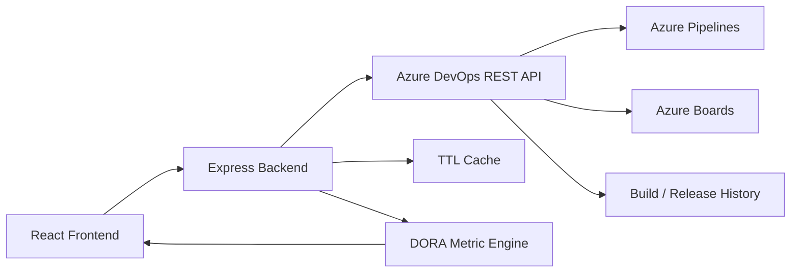
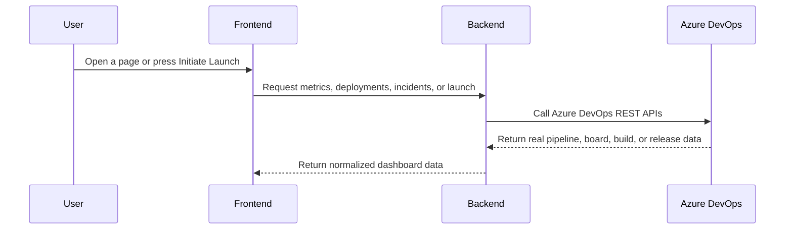

# DORA Metrics & Release Health Command Center

This repository is a full-stack Azure DevOps observability app for DORA metrics and release health.
It reads real data from Azure DevOps, computes the four DORA metrics, and exposes a launch flow that queues a real pipeline run from the backend.

Identity shown in the UI is intentionally normalized to `Gargi and Rudra`.

## What the app does

The system is built to answer four questions from real Azure DevOps data:

1. How often are we deploying?
2. How long do changes take to reach production?
3. How often do changes fail?
4. How long does recovery take when something breaks?

It also supports:

- live Azure DevOps connectivity checks
- pipeline discovery
- build and release history reads
- Azure Boards incident/work-item reads
- real pipeline queueing from the launch modal

## Architecture





## Repository layout

```text
frontend/   React app
backend/    Express API server
README.md   Project-level documentation
azure-pipelines.yml   Azure DevOps pipeline definition
```

## Frontend structure

The frontend is the user-facing dashboard.
It is responsible for navigation, charts, tables, filters, the launch modal, and layout.

### Root frontend files

- `frontend/index.html`: Vite entry HTML shell.
- `frontend/package.json`: frontend scripts and dependencies.
- `frontend/vite.config.js`: Vite build/dev configuration.
- `frontend/tailwind.config.js`: Tailwind configuration.
- `frontend/postcss.config.js`: PostCSS pipeline.
- `frontend/jsconfig.json`: path and editor support.
- `frontend/public/*`: static public assets such as icons and manifest.
- `frontend/src/App.jsx`: root React component and provider wrapper.
- `frontend/src/main.jsx`: React bootstrap entry point.
- `frontend/src/App.css`: app-level component styles.
- `frontend/src/index.css`: base global CSS import surface.

### Frontend folder map

- `frontend/src/assets/`: local images and SVG assets used by the UI.
- `frontend/src/components/cards/`: summary cards for metrics and insights.
- `frontend/src/components/charts/`: all chart components, including lead time, MTTR, deployment, and failure rate views.
- `frontend/src/components/effects/`: animated background and visual layers.
- `frontend/src/components/feedback/`: loading, empty, error, and toast states.
- `frontend/src/components/filters/`: dashboard filters for date, environment, pipeline, search, and status.
- `frontend/src/components/layout/`: top-level layout pieces such as sidebar, navbar, footer, page wrappers, and the launch modal host.
- `frontend/src/components/tables/`: tabular views for deployments, incidents, and work items.
- `frontend/src/components/ui/`: reusable low-level UI controls.
- `frontend/src/context/`: shared React context providers.
- `frontend/src/hooks/`: data-fetching and UI behavior hooks.
- `frontend/src/pages/`: routed pages such as Dashboard, Deployments, Incidents, Reports, Analytics, and Settings.
- `frontend/src/routes/`: React Router route configuration.
- `frontend/src/services/`: API client wrappers for backend calls.
- `frontend/src/styles/`: CSS modules and style tokens.
- `frontend/src/utils/`: pure helper functions for formatting, grading, naming, colors, and calculations.

### Frontend file-by-file purpose

#### `frontend/src/App.jsx`
- Wraps the whole app in `BrowserRouter`.
- Mounts `ThemeProvider`, `FilterProvider`, and `DashboardProvider`.
- Mounts the global toast container.
- Keeps app-wide state available to every page.

#### `frontend/src/main.jsx`
- React DOM entry point.
- Loads the app into the root DOM node.

#### `frontend/src/routes/AppRoutes.jsx`
- Declares the route map.
- Connects pages to the shared layout.
- Handles the app's navigation surface.

#### `frontend/src/components/layout/ProtectedLayout.jsx`
- Main shell around authenticated pages.
- Contains the launch modal.
- Loads real pipeline definitions before allowing queueing.
- Sends launch requests to the backend.
- Displays the signed-in profile and handles modal state.

#### `frontend/src/components/layout/Navbar.jsx`
- Top navigation bar.
- Displays live connection status and profile info.
- Gives the dashboard its page-level context.

#### `frontend/src/components/layout/Sidebar.jsx`
- Side navigation for the major pages.
- Hosts the launch entry point and telemetry settings shortcut.
- Keeps the current section visible.

#### `frontend/src/components/layout/Footer.jsx`
- Bottom status strip.
- Shows system and API health text.

#### `frontend/src/components/layout/PageContainer.jsx`
- Common page wrapper.
- Stabilizes spacing and overflow behavior.

#### `frontend/src/components/layout/PageHeader.jsx`
- Reusable page title/header block.
- Standardizes the top of each page.

#### `frontend/src/components/cards/*`
- `MetricCard.jsx`: primary metric display.
- `StatusCard.jsx`: health and status summary.
- `ActivityCard.jsx`: recent activity display.
- `SummaryCard.jsx`: compact summary block.
- `GlassCard.jsx`: shared visual wrapper.
- `InsightCard.jsx`: recommendation / insight display.

#### `frontend/src/components/charts/*`
- `DeploymentChart.jsx`: deployment throughput visualization.
- `LeadTimeChart.jsx`: lead-time trend chart.
- `FailureRateChart.jsx`: change-failure visualization.
- `MTTRChart.jsx`: recovery-time visualization.
- `MonthlyChart.jsx`: monthly rolling chart.
- `WeeklyChart.jsx`: weekly rolling chart.
- `PieOverview.jsx`: slice-based overview chart.
- `Sparkline.jsx`: compact trend sparkline.

#### `frontend/src/components/feedback/*`
- `Loader.jsx`: loading state.
- `Skeleton.jsx`: content placeholder.
- `ErrorState.jsx`: failure state.
- `EmptyState.jsx`: no-data state.
- `NoData.jsx`: empty/null fallback.
- `ToastMessage.jsx`: toast helpers.

#### `frontend/src/components/filters/*`
- `DateFilter.jsx`: date range selection.
- `EnvironmentFilter.jsx`: environment selection.
- `PipelineFilter.jsx`: pipeline selection.
- `SearchBar.jsx`: query input.
- `StatusFilter.jsx`: status filter.

#### `frontend/src/components/tables/*`
- `DeploymentTable.jsx`: deployment ledger rows.
- `IncidentTable.jsx`: incident ledger rows.
- `WorkItemTable.jsx`: Azure Boards work items.
- `TableHeader.jsx`: table header row.
- `TablePagination.jsx`: paging controls.
- `StatusBadge.jsx`: status display pill.

#### `frontend/src/services/*`
- `api.js`: Axios client and response unwrapping.
- `authService.js`: current user/profile lookup.
- `deploymentService.js`: deployment ledger and launch requests.
- `incidentService.js`: incident ledger operations.
- `metricsService.js`: DORA metric reads and trend requests.
- `pipelineService.js`: pipeline discovery and build history.
- `projectService.js`: Azure project listing.
- `reportService.js`: report assembly/export helpers.
- `workItemService.js`: Azure Boards work item reads.

#### `frontend/src/context/*`
- `DashboardContext.jsx`: dashboard-wide data and state.
- `FilterContext.jsx`: filter state shared across pages.
- `ThemeContext.jsx`: theme state and theme toggles.

#### `frontend/src/hooks/*`
- `useDeployments.js`: deployment data fetching and actions.
- `useIncidents.js`: incident data fetching and actions.
- `useMetrics.js`: metric data fetching.
- `usePagination.js`: paging state.
- `useSearch.js`: search state.
- `useTheme.js`: theme access helper.

#### `frontend/src/utils/*`
- `displayNames.js`: maps backend-facing names to the UI display name rules.
- `doraGrading.js`: DORA scoring / grade helpers.
- `calculateTrend.js`: trend math.
- `chartConfig.js`: shared chart settings.
- `colors.js`: theme colors.
- `constants.js`: static app constants.
- `formatDate.js`: date formatting.
- `formatNumber.js`: number formatting.
- `helpers.js`: general utility helpers.
- `statusColor.js`: status-to-color mapping.

## Backend structure

The backend is the Azure DevOps integration layer.
It owns authentication, Azure API calls, caching, filtering, metric calculations, and launch handling.

### Root backend files

- `backend/package.json`: backend scripts and dependencies.
- `backend/package-lock.json`: locked dependency graph.
- `backend/app.js`: Express application wiring.
- `backend/server.js`: process bootstrap and shutdown handlers.
- `backend/.env`: local developer environment file, not committed.
- `backend/.env.example`: sample environment file.
- `backend/README.md`: backend-specific documentation.
- `backend/test_integration.js`: integration test helper.
- `backend/test_stress.js`: stress test helper.

### Backend folder map

- `backend/src/config/`: environment and Azure client setup.
- `backend/src/controllers/`: HTTP handlers.
- `backend/src/middleware/`: auth, validation, error handling, and 404 handling.
- `backend/src/routes/`: REST route definitions.
- `backend/src/services/`: Azure data access and business logic.
- `backend/src/utils/`: logging, date, and metric helpers.

### Backend file-by-file purpose

#### `backend/src/config/env.js`
- Loads `.env`.
- Validates required Azure environment variables.
- Exposes typed config values to the rest of the app.

#### `backend/src/config/azure.js`
- Builds authenticated Axios clients for Azure DevOps core and release APIs.
- Central place for Azure REST base URLs and PAT auth.

#### `backend/src/middleware/auth.js`
- Resolves the PAT used for each request.
- Supports optional `Bearer` override tokens.
- Attaches Azure client factories to the request object.

#### `backend/src/middleware/errorHandler.js`
- Converts Azure and server failures into clean JSON responses.
- Maps 401/403/404 Azure errors into actionable messages.

#### `backend/src/middleware/notFound.js`
- Returns a 404 for unknown routes.

#### `backend/src/middleware/validation.js`
- Validates route inputs such as pagination and launch payloads.

#### `backend/src/controllers/authController.js`
- Returns the authenticated Azure profile information.

#### `backend/src/controllers/dashboardController.js`
- Returns the combined dashboard payload.

#### `backend/src/controllers/deploymentController.js`
- Returns deployment ledgers.
- Accepts launch requests.

#### `backend/src/controllers/incidentController.js`
- Returns incident ledgers.
- Creates and resolves incident work items.

#### `backend/src/controllers/metricsController.js`
- Returns DORA metrics and trends.

#### `backend/src/controllers/pipelineController.js`
- Returns pipelines and builds.

#### `backend/src/controllers/projectController.js`
- Returns accessible Azure DevOps projects.

#### `backend/src/controllers/workItemController.js`
- Returns Azure Boards work items.

#### `backend/src/routes/*`
- Wire each controller to its REST endpoint.
- Keep transport concerns separate from business logic.

#### `backend/src/services/cacheService.js`
- In-memory TTL cache.
- Prevents repeatedly calling Azure for the same filtered query.

#### `backend/src/services/azureService.js`
- Shared helper for WIQL queries and work-item hydration.
- Provides low-level Azure DevOps request utilities.

#### `backend/src/services/deploymentService.js`
- Builds the combined deployment ledger.
- Queues YAML pipelines or classic releases.
- Reads real Azure build/release history.

#### `backend/src/services/incidentService.js`
- Reads Azure Boards work items for incidents/outages.
- Creates and resolves incident work items.
- Converts Azure fields into frontend-friendly incident rows.

#### `backend/src/services/metricsService.js`
- Computes DORA metrics from deployment and incident data.
- Produces chart/trend-ready metric responses.

#### `backend/src/services/pipelineService.js`
- Lists Azure pipelines.
- Returns build history filtered by query parameters.

#### `backend/src/services/projectService.js`
- Retrieves Azure DevOps projects.

#### `backend/src/services/workItemService.js`
- Retrieves Azure Boards items for reporting surfaces.

#### `backend/src/utils/logger.js`
- Server-side structured logging.

#### `backend/src/utils/dateUtils.js`
- Date and time helpers used by metrics and formatting.

#### `backend/src/utils/metricUtils.js`
- DORA-specific calculations and scoring helpers.

#### `backend/server.js`
- Starts the HTTP server.
- Handles graceful shutdown and crash logging.

#### `backend/app.js`
- Assembles Express middleware, routes, and error handling.

## Key data flow

### Dashboard reads

- Frontend page requests go to the backend API.
- Backend reads Azure DevOps.
- Backend normalizes the data.
- Frontend renders charts, tables, and status panels.

### Launch flow

- User opens the launch modal.
- Frontend loads live pipelines from the backend.
- User selects a pipeline, environment, and version.
- Frontend posts launch payload to `POST /api/deployments`.
- Backend resolves the Azure pipeline and tries a real queue call.
- Azure returns the run metadata or a real authorization error.

## Local setup

### Backend

```bash
cd backend
npm install
npm run dev
```

### Frontend

```bash
cd frontend
npm install
npm run dev
```

## Environment variables

### Required backend values

- `AZURE_PAT`
- `AZURE_ORGANIZATION`
- `AZURE_PROJECT`

### Optional backend values

- `AZURE_API_VERSION`
- `AZURE_INCIDENT_WORK_ITEM_TYPE`
- `FRONTEND_URL`

## API surface

- `GET /api/health`
- `GET /api/auth/me`
- `GET /api/dashboard`
- `GET /api/metrics`
- `GET /api/metrics/trends/:period`
- `GET /api/deployments`
- `POST /api/deployments`
- `GET /api/incidents`
- `POST /api/incidents`
- `PUT /api/incidents/:id/resolve`
- `GET /api/projects`
- `GET /api/pipelines`
- `GET /api/builds`
- `GET /api/work-items`

## Notes

- The app is intentionally connected to real Azure DevOps data.
- Empty states are real empty states, not fake demo data.
- If Azure denies queueing with 401, the PAT permissions still need to be corrected in Azure DevOps.
