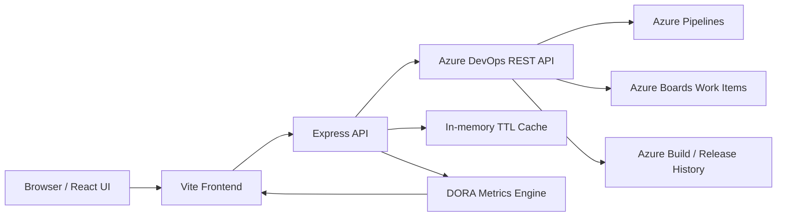
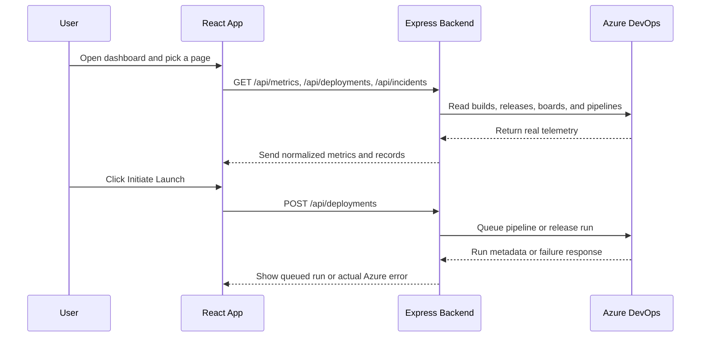

# DORA Metrics & Release Health Command Center

This project is a full-stack Azure DevOps dashboard for tracking DORA metrics from real pipeline and incident data. It is built for a small operating team, and the user identity shown in the app is intentionally limited to `Gargi and Rudra`.

The dashboard reads from Azure DevOps and presents:

1. Deployment Frequency
2. Lead Time for Changes
3. Change Failure Rate
4. Mean Time to Recovery

It also includes a launch modal that queues a real Azure pipeline from the backend, using the server-side PAT and Azure DevOps REST APIs.

## Architecture



### Request flow



## What is live

- Real Azure DevOps connectivity checks
- Real pipeline discovery
- Real build and release history reads
- Real incident and bug work-item queries
- Real launch request handling, with backend fallback logic for Azure API differences
- No fake demo records in the main data path

## Repository layout

```text
frontend/  React application
backend/   Express API server
```

## Local development

### Prerequisites

- Node.js 18 or newer
- An Azure DevOps PAT with the required scopes configured in `backend/.env`

### Backend

```bash
cd backend
npm install
npm run dev
```

Backend default:

- `http://localhost:5000/api`

### Frontend

```bash
cd frontend
npm install
npm run dev
```

Frontend default:

- `http://localhost:5173`

## Environment variables

Backend requires:

- `AZURE_PAT`
- `AZURE_ORGANIZATION`
- `AZURE_PROJECT`

Optional:

- `AZURE_API_VERSION`
- `AZURE_INCIDENT_WORK_ITEM_TYPE`
- `FRONTEND_URL`

## API surface

- `GET /api/health`
- `GET /api/auth/me`
- `GET /api/dashboard`
- `GET /api/metrics`
- `GET /api/metrics/trends/:period`
- `GET /api/deployments`
- `POST /api/deployments`
- `GET /api/incidents`
- `POST /api/incidents`
- `PUT /api/incidents/:id/resolve`
- `GET /api/projects`
- `GET /api/pipelines`
- `GET /api/builds`
- `GET /api/work-items`

## Notes

- The launch modal now sends real pipeline identifiers from Azure DevOps.
- The backend no longer invents metrics or incident rows when Azure returns nothing.
- If Azure returns `401` on launch, that is an Azure PAT permission issue, not a UI-only issue.
