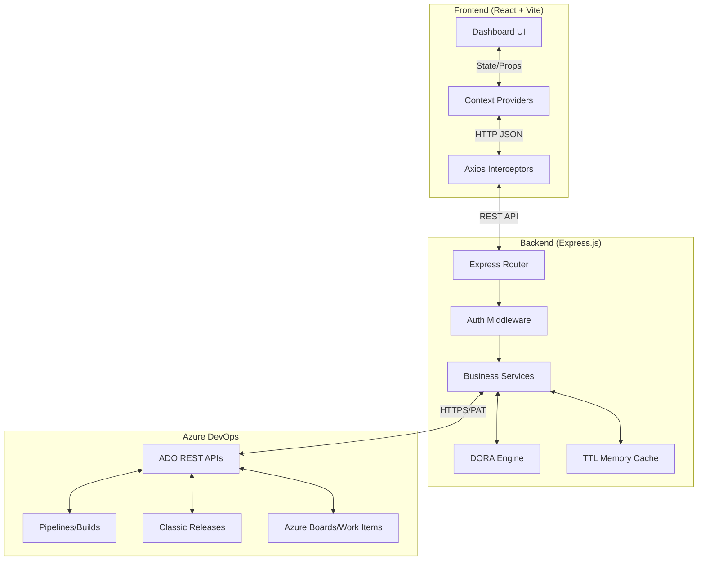

# 🚀 DORA Metrics & Release Health Command Center


This repository is a full-stack **Azure DevOps observability application** tailored specifically for DORA metrics and release health. It actively reads live telemetry from Azure DevOps, mathematically computes delivery metrics from that raw telemetry, and presents the results in a futuristic, high-performance React dashboard that engineering leadership can actually use.

The application centers on the four DORA (DevOps Research and Assessment) metrics:
1. **Deployment Frequency (DF)**
2. **Lead Time for Changes (LT)**
3. **Change Failure Rate (CFR)**
4. **Mean Time to Recovery (MTTR)**

The UI identity is intentionally normalized to `Gargi and Rudra`.

---

## 🌟 What the System Achieves

This app answers the practical delivery questions that show up in release reviews:
- **Are we shipping often enough?** (Deployment Frequency)
- **Are changes reaching production fast enough?** (Lead Time)
- **Are changes introducing too much risk?** (Change Failure Rate)
- **Are we recovering quickly enough when something goes wrong?** (MTTR)

It also supports a **real launch flow** directly from the dashboard. The pipeline launch modal is not decorative—it loads live pipeline definitions and submits a real Azure DevOps queue request through the Express backend.

---

## 🏗️ High-Level System Architecture



---

## 🔄 Request & Data Flow Diagram

```mermaid
sequenceDiagram
  autonumber
  participant U as User
  participant UI as Frontend (React)
  participant BE as Backend (Express)
  participant AZ as Azure DevOps

  U->>UI: Open Dashboard page (e.g. 90-day window)
  UI->>BE: GET /api/dashboard?dateRange=90d
  
  rect rgb(20, 30, 50)
    Note over BE: Middleware & Caching Layer
    BE->>BE: Validate PAT & rate limits
    BE->>BE: Check TTL Cache (metrics_90d)
  end
  
  opt Cache Miss
    BE->>AZ: Fetch Pipeline Runs & Releases
    AZ-->>BE: Return Deployment Data
    BE->>AZ: Fetch Azure Boards (Bug Work Items)
    AZ-->>BE: Return Incident Data
    BE->>BE: Compute DORA Metrics (LT, DF, CFR, MTTR)
    BE->>BE: Store in TTL Cache (300s)
  end
  
  BE-->>UI: Return Normalized Payload (Total Deployments, Incidents, Sparks)
  UI->>UI: Grade metrics (Elite, High, Medium, Low)
  UI-->>U: Render Glassmorphic UI with exact data
```



---

## 📂 Repository Layer Model

The repository is intentionally split into layers so each architectural concern stays completely isolated.

### 1. Presentation Layer (`frontend/src/`)
Owns pages, components, charts, tables, filters, layout, animation, and UI feedback. It renders state but does not hold any Azure DevOps API credentials or direct SDKs.

### 2. Transport Layer (`backend/src/controllers/` & `routes/`)
Owns endpoint mapping, request parsing, response formatting, and HTTP status codes. Controllers stay thin, moving data in and out without holding business logic.

### 3. Business Layer (`backend/src/services/`)
Owns deployment ledger creation, incident ledger creation, mathematical DORA calculations, pipeline launch orchestration, Azure response normalization, and caching behavior.

### 4. Integration Layer (`backend/src/config/` & `middleware/`)
Owns Personal Access Token (PAT) resolution, Azure API client generation, request-scoped auth behavior, and error handling.

---

## 🛠️ Comprehensive File & Component Breakdown

### 🌐 Frontend Breakdown (`frontend/`)

The frontend is the user-facing dashboard built with React, Vite, and Tailwind CSS. It handles navigation, data fetching, charting (via Recharts), tables, and all visible feedback.

#### Root Configuration Files
- **`index.html`**: The Vite entry HTML document. Defines the mounting `<div id="root">`.
- **`vite.config.js`**: Vite build and dev configuration. Sets up proxy rules and React plugins.
- **`tailwind.config.js`**: Defines the extensive custom design system, including glassmorphic colors, gradients, specific typography, and breakpoints.
- **`postcss.config.js`**: PostCSS setup for Tailwind compilation.
- **`.env`**: Frontend runtime environment values (e.g., `VITE_API_URL`).

#### Core Application Bootstrap
- **`src/main.jsx`**: React boot entry point. Mounts the React tree into the root DOM node and applies global styles.
- **`src/App.jsx`**: Root component. Wraps the app in `BrowserRouter`, installs `ThemeProvider`, `FilterProvider`, and `DashboardProvider`, and mounts the shared toast container.
- **`src/routes/AppRoutes.jsx`**: Defines page routing. Wires up Dashboard, Deployments, Incidents, Analytics, Reports, and Settings to their respective URLs, wrapped in `ProtectedLayout`.

#### Context Providers (`src/context/`)
- **`DashboardContext.jsx`**: Stores globally shared dashboard data (deployments, incidents, overarching metrics) to prevent redundant API calls across pages.
- **`FilterContext.jsx`**: Manages global filter states like `dateRange` (7d, 30d, 90d) and `environment` (Production, Staging).
- **`ThemeContext.jsx`**: Manages light/dark mode toggling and OS preference syncing.

#### Layout & Shell (`src/components/layout/`)
- **`ProtectedLayout.jsx`**: The main app shell. Renders the Sidebar, Navbar, and Footer, and hosts the global Pipeline Launch Modal.
- **`Sidebar.jsx`**: Vertical navigation rail linking all major operational surfaces. Contains the dynamic user identity block.
- **`Navbar.jsx`**: Top navigation bar offering global search, connection health badges, and real-time status cues.
- **`Footer.jsx`**: Bottom status bar surfacing system state and operational health text.

#### Pages (`src/pages/`)
- **`Dashboard.jsx`**: The executive landing screen. Renders dynamic DORA metric cards, SVG sparklines, and insight recommendations. Features robust zero-data fallback states.
- **`Analytics.jsx`**: Deeper telemetry analysis. Renders the Lead Time AreaChart, Process Efficiency scores, and the detailed Pipeline Stage Breakdown table.
- **`Incidents.jsx`**: Focuses on stability. Renders Mean Time to Restore (MTTR) trends, Change Failure Rates, and the active Incident ledger.
- **`Deployments.jsx`**: The deployment ledger page displaying pipeline run history with detailed cycle times and statuses.
- **`Reports.jsx`**: Automated executive summaries. Grades overall health and offers exportable DORA scorecard breakdowns.
- **`Settings.jsx`**: User configuration. Allows dynamic updates to the API URL, DORA grading thresholds (DF, LT, CFR, MTTR limits), and tests backend connectivity.

#### Components (`src/components/`)
- **`cards/`**: Reusable `GlassCard.jsx`, `MetricCard.jsx`, and `InsightCard.jsx` wrappers providing the signature glassmorphic UI aesthetic.
- **`charts/`**: Wrappers around `Recharts` for Area, Line, and Sparkline visualizations. Features custom SVG gradients and tooltips.
- **`feedback/`**: `EmptyState.jsx`, `Loader.jsx`, `Skeleton.jsx`, and `ToastMessage.jsx` for robust UX during data fetches or zero-data scenarios.
- **`tables/`**: Complex data grid components like `DeploymentTable.jsx` and `IncidentTable.jsx` with pagination and status badges.

#### Services (`src/services/`)
- **`api.js`**: The core Axios client instance. Dynamically resolves the `baseURL` from local storage and features interceptors to unwrap backend JSON envelopes and catch errors.
- **`metricsService.js`**: Makes API calls to `/api/dashboard/metrics` and `/api/dashboard/trends`.
- **`deploymentService.js` & `incidentService.js`**: Handles calls for raw ledger data and triggering actions (launching pipelines, resolving incidents).

---

### 🖥️ Backend Breakdown (`backend/`)

The Express.js backend serves as the orchestration and mathematical engine. It isolates the frontend from Azure DevOps API complexities, handles authentication, and normalizes payloads.

#### Root Configuration Files
- **`app.js`**: Express application assembly. Configures CORS, Helmet security headers, compression, rate limiting, and mounts all route handlers.
- **`server.js`**: Runtime bootstrap. Starts the Express listener on the designated PORT and handles graceful shutdown signals (SIGTERM/SIGINT).
- **`.env`**: Stores secure secrets like `AZURE_PAT`, `AZURE_ORGANIZATION`, and `AZURE_PROJECT`.
- **`test_stress.js`**: An extensive 100-case automated test suite verifying boundary conditions, pagination limits, and secure error handling.

#### Configuration & Middleware (`src/config/` & `src/middleware/`)
- **`config/env.js`**: Validates the presence of required `.env` variables on startup, ensuring fail-fast behavior if Azure credentials are missing.
- **`config/azure.js`**: Generates pre-configured Axios clients for Azure Core REST APIs and Azure Release APIs, automatically attaching the PAT.
- **`middleware/auth.js`**: Inspects incoming requests for Bearer tokens, falling back to the system PAT. It injects the authenticated Azure client into `req.azureClient`.
- **`middleware/errorHandler.js`**: A global exception catcher. It actively redacts sensitive tokens (like `[REDACTED]`) from logs and formats standard `{ success: false, error: ... }` JSON responses.
- **`middleware/validation.js`**: Enforces strict payload formatting (e.g., blocking negative limits or malformed date ranges) before hitting controllers.

#### Routes & Controllers (`src/routes/` & `src/controllers/`)
- **`metricsRoutes.js` / `metricsController.js`**: Handles requests for DORA metrics. Extracts `dateRange` and `environment` queries and passes them to the metrics service.
- **`deploymentRoutes.js` / `deploymentController.js`**: Handles fetching deployment ledgers and orchestrating POST requests to trigger new pipeline runs.
- **`incidentRoutes.js` / `incidentController.js`**: Manages the retrieval of Bug/Incident work items and actions to resolve them.
- **`dashboardRoutes.js` / `dashboardController.js`**: Aggregates data across multiple domains into a single unified payload for the frontend dashboard.

#### Core Business Services (`src/services/`)
- **`metricsService.js` (The DORA Engine)**: 
  - The most complex mathematical component. It fetches both deployment and incident data concurrently.
  - Slices data into current vs. previous timeframes.
  - Computes **Lead Time** (averaging duration of successful runs).
  - Computes **Deployment Frequency** (success runs / days).
  - Computes **Change Failure Rate** (failed runs / total runs).
  - Computes **MTTR** (average duration of resolved incidents).
  - Generates partitioned data buckets for frontend Sparklines.
  - Exposes explicit `totalDeployments` and `totalIncidents` counts to enable flawless frontend empty-state rendering.
- **`deploymentService.js`**: Queries Azure Pipelines (Builds) and Classic Releases. Merges them, maps their disparate data models into a unified `Deployment` object, and handles complex trigger logic (falling back across different Azure Queue APIs if necessary).
- **`incidentService.js`**: Uses Azure Work Item Query Language (WIQL) to fetch bugs. Parses `System.CreatedDate`, `System.State`, and `System.Tags` to calculate exact incident lifespans.
- **`cacheService.js`**: Implements a localized TTL (Time-To-Live) memory cache (default 300s). This prevents rate-limiting from Azure and ensures the dashboard loads instantly on navigation.

#### Utilities (`src/utils/`)
- **`metricUtils.js`**: Contains pure functions for grading metrics (e.g., determining if a Lead Time of 1.2 hours is "Elite" or "High" based on industry standards).
- **`logger.js`**: Custom logging utility with regex-based credential stripping to ensure secure console output.

---

## 🚀 Setup & Installation

### 1. Prerequisites
- Node.js (v18+ recommended)
- An Azure DevOps organization and project
- An Azure DevOps Personal Access Token (PAT) with `Read & Execute` permissions for Build, Release, and Work Items.

### 2. Backend Configuration
1. Navigate to the backend directory:
   ```bash
   cd backend
   npm install
   ```
2. Create a `.env` file in `backend/`:
   ```env
   PORT=5000
   NODE_ENV=development
   FRONTEND_URL=http://localhost:5173
   AZURE_ORGANIZATION=your-org-name
   AZURE_PROJECT=your-project-name
   AZURE_PAT=your-base64-encoded-or-raw-pat
   AZURE_INCIDENT_WORK_ITEM_TYPE=Bug
   ```
3. Start the server:
   ```bash
   npm run dev
   ```

### 3. Frontend Configuration
1. Navigate to the frontend directory:
   ```bash
   cd frontend
   npm install
   ```
2. Create a `.env` file in `frontend/`:
   ```env
   VITE_API_URL=http://localhost:5000/api
   ```
3. Start the Vite dev server:
   ```bash
   npm run dev
   ```

4. Open your browser to `http://localhost:5173/`. 
*Note: You can update the API URL dynamically inside the application via the **Settings** page.*

---

## 🛡️ Security & Hardening Features

- **Dynamic Zero-Data Architecture**: If a project has 0 deployments or 0 incidents, the mathematical engine explicitly returns correct flags, forcing the UI to display `--` and "NO DATA" rather than misleading `0.0 HOURS` / `0%` metrics.
- **Credential Redaction**: The backend `logger.js` utilizes recursive regex to strip `Authorization` headers, `Basic` base64 values, and `Bearer` tokens from all console outputs and error traces.
- **DDoS / Rate Limiting Protection**: `express-rate-limit` is configured to protect API endpoints, and a 5-minute TTL cache drastically reduces redundant outbound calls to Azure APIs.
- **Strict Payload Validation**: Middleware outright rejects malformed pagination (`page=1.5`), negative constraints, or unsupported date ranges with pristine `400 Bad Request` messages.

---
*Built with precision for engineering excellence.*
